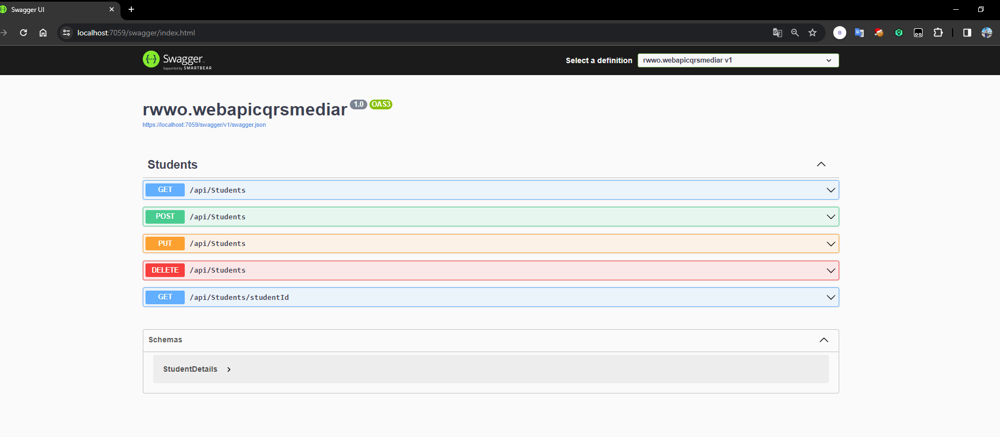

# Introdução ao Padrão CQRS
## Quando usar o CQRS
## MediatR

## Pré-requisitos
* Visual Studio 2022
* PostgreSQL
* .NET Core 6

### Introdução ao Padrão CQRS
CQRS significa Command and Query Responsibility Segregation e é utilizado para separar as operações de leitura (consultas) das operações de escrita (comandos).

Nesse contexto, as consultas realizam operações de leitura, enquanto os comandos realizam operações de escrita, como criar, atualizar,
excluir e retornar dados.

Como sabemos, em nossa aplicação, geralmente utilizamos um único modelo de dados para ler e escrever dados, o que funciona bem e permite realizar 
operações CRUD facilmente. No entanto, quando a aplicação se torna extensa, nossas consultas passam a retornar diferentes tipos de dados como objeto,
tornando difícil gerenciar diferentes objetos DTO. Além disso, o mesmo modelo é utilizado para realizar operações de escrita, resultando em um modelo 
complexo.

Além disso, ao usar o mesmo modelo para operações de leitura e escrita, a segurança também se torna difícil de gerenciar quando a aplicação é grande,
e a entidade pode expor dados no contexto errado devido à carga de trabalho no mesmo modelo. O CQRS ajuda a desacoplar as operações e torna a aplicação
mais escalável e flexível em grande escala.

### Quando utilizar o CQRS

Podemos utilizar a Segregação de Responsabilidades de Comando e Consulta (CQRS) quando a aplicação é extensa e acessa os mesmos dados em paralelo.
O CQRS ajuda a reduzir conflitos de mesclagem ao realizar várias operações com os dados.

Em termos de Domain-Driven Design (DDD), se o modelo de dados do domínio for complexo e precisar realizar muitas operações com prioridade,
como validações e execução de lógica de negócios, nesse caso, precisamos da consistência que será alcançada utilizando o CQRS.

### Padrão MediatR

O padrão MediatR ajuda a reduzir a dependência direta entre múltiplos objetos e a torná-los colaborativos por meio do MediatR. No .NET Core, 
o MediatR fornece classes que ajudam a comunicar eficientemente com vários objetos de maneira desacoplada.

